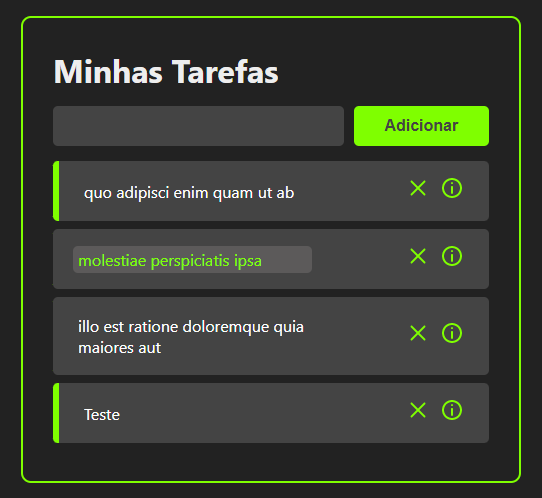
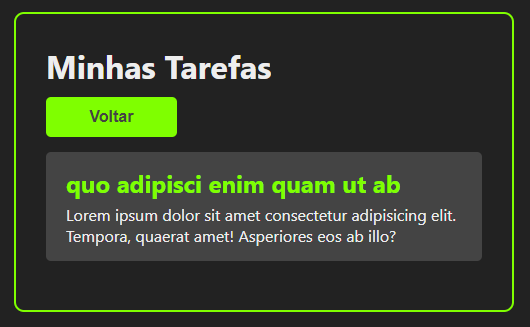

<h1 align="center">TodoIst React</h1>

Gerenciador de tarefas feito com React

<h1 align="center">
  
  
</h1>

### Características

- [x] React components
- [x] React Hooks
- [x] Consumação de API
- [x] Adicionar tarefas
- [x] Excluir tarefas
- [x] Marcar como concluída
- [x] Detalhes da tarefa

### Tecnologias

As ferramentas que utilizei na construção do projeto foram:

- [REACT](https://pt-br.reactjs.org/)
- [JAVASCRIPT](https://www.javascript.com/)
- [REACT ROUTER](https://reactrouter.com/en/main)
- [CSS3](https://developer.mozilla.org/pt-BR/docs/Web/CSS)
- [HTML5](https://developer.mozilla.org/pt-BR/docs/Web/HTML)
- [React Icons](https://react-icons.github.io/react-icons/)
- [Axios](https://axios-http.com/ptbr/docs/intro)
- [uuid](https://www.uuidgenerator.net/)

---

[LinkedIn](https://www.linkedin.com/in/felipegois/)
